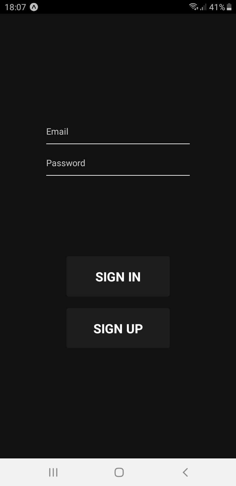
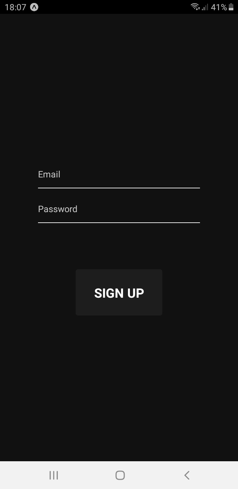

<h1 align="center">User Authentication</h1>

  
  

<h3>Technologies used in this project</h3>
<ul>
<li>NodeJs</li>
<li>Expo</li>
<li>JWT ( JsonWebToken ) </li>
<li>Celebrate</li>
<li>Styled-Components</li>
</ul>

<h3>How to initialize project</h3>
<b>Clone this repo</b>
   

     git clone https://github.com/leandro-wrf/login-authentication.git
     cd login-authentication

<b>Backend:</b>

    cd backend && yarn
    yarn dev

<b>Mobile:</b>

     cd mobile && yarn
     expo start

<h4>What I learned from this project</h4>

Using the functions of jwt.sign and jwt.verify, creating table models to use sequelize, understanding the idea of migrations in sequelize, I added validations to this project, both on mobile and backend.
Something I understood during the process, the use of react-native, for this project I decided to remove it and test it in other applications, because as I found myself in an application where the focus was different, I ended up mixing things up and added something unnecessary, even though I knew that the expo would serve the necessary use of my project.

Something very important for me, and that I will take as knowledge.
The organization of the files in the project helps a lot to not get lost, not to pollute a file with codes, thus making your reading less complex and that ends up impelling you to finish what you started.

<h1>LICENSE</h1>
Lincense MIT.
